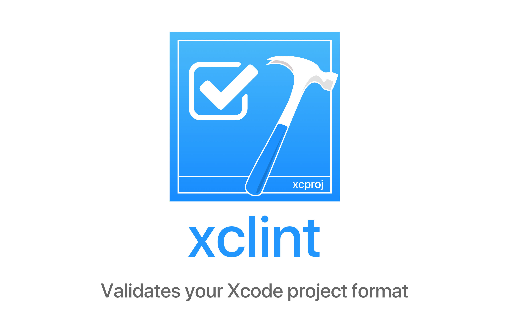

<br/>

<a href="https://travis-ci.org/carambalabs/xclint">
    
</a>
<a href="https://swift.org/package-manager">
    
</a>
<a href="https://twitter.com/xcodedotswift">
    
</a>
<a href="https://codecov.io/gh/carambalabs/xcodeproj">
  
</a>
<a href="https://opensource.org/licenses/MIT">
  
</a>

`xclint` is a command line tool written in Swift that validates the state of your Xcode Project. It's able to find duplicated and missing files, inconsistencies between the groups and the folders in your system...

## Install 🥑

You can easily install xclint with Homebrew:

```
brew tap xcodeswift/xclint git@github.com:xcodeswift/xclint.git
brew install xclint
```

You can also easily run the tool using [🌱 Mint](https://github.com/yonaskolb/mint):

```bash
mint run xcodeswift/xclint
```

## Setup ⚙️

1. Git clone the repository `git clone git@github.com:xcodeswift/xclint.git`
2. Build with `swift build`


### How to use it 🙃

```bash
xclint MyProject.xcodeproj
```

## Documentation 📄
You can check out the documentation on the following [link](https://xcodeswift.github.io/xclint/index.html). The documentation is automatically generated in every release by using [Jazzy](https://github.com/realm/jazzy) from [Realm](https://realm.io).

### References

- [Rainbow](https://github.com/onevcat/Rainbow)
- [Commander](https://github.com/kylef/Commander.git)
